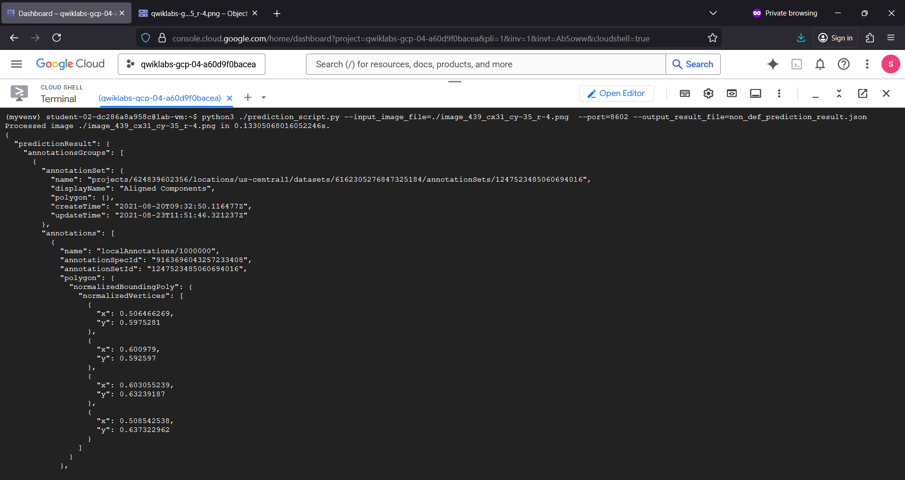

# pcbmanudef 🏭🤖
pcbmanudef : Manufacturing Anomaly Detection Model # Visual Inspection AI # PCB # Assembly Inspection # Defect

## Objective
- Identify and detect components.
- Apply alignment and detection of components.
- Train a Visual Inspection Assembly Inspection detection model.
- Review process involved in evaluation of trained Assembly Inspection anomaly detection models.
- Review process of creating a trained Assembly Inspection anomaly detection solution artifact.
- Deploy a trained Assembly Inspection solution artifact.
- Perform a batch prediction using an Assembly Inspection solution artifact.

## PCB Manufacturing Anomaly Detection Model

